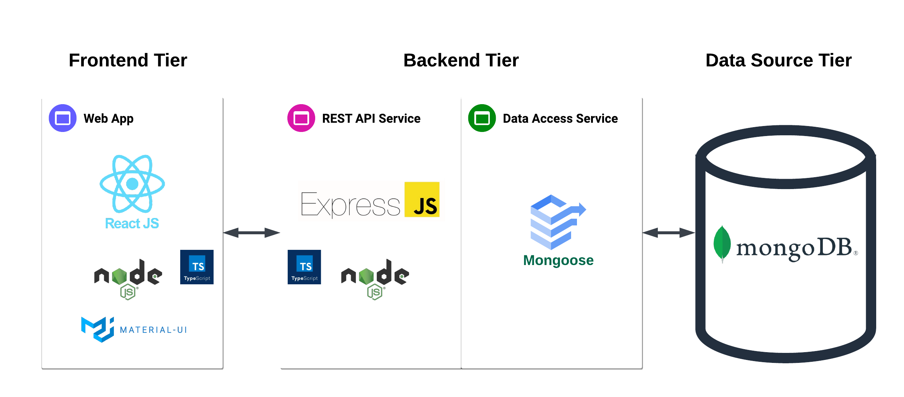
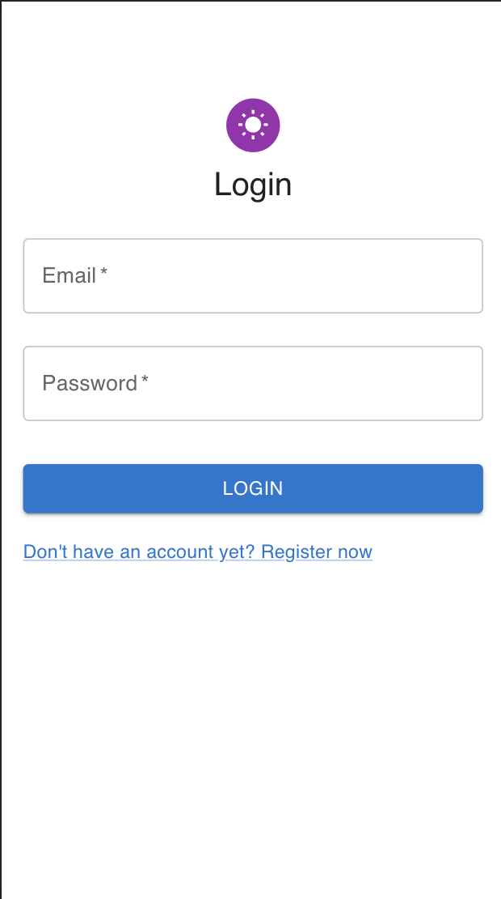

# 🌞 SUNSHINE (Frontend)

See the application structure in the image below:


This is the Frontend application.
For the Backend application, please go to [https://github.com/leogomesdev/sunshine-backend](https://github.com/leogomesdev/sunshine-backend)

## 📚 Description

This application contains a register page and a login page. After logging in, the user can see the sunshine ;)

## 📲 Main technologies used

- [React](https://reactjs.org) version 18, a JavaScript library for building user interfaces
- [Material UI](https://mui.com), the library of React components which implements Google's Material Design
- [TypeScript](https://www.typescriptlang.org), JavaScript with syntax for types
- [Jest](https://jestjs.io) for unit tests
- [Commitizen command line tool](https://github.com/commitizen/cz-cli)
- [Conventional Commits specification](https://www.conventionalcommits.org/en/v1.0.0/)
- [Create React App](https://github.com/facebook/create-react-app), used to bootstrap this project

## 💡 Requirements

### 💻 For local usage:

- [Node.js](https://nodejs.org) (v18)
- [npm](https://www.npmjs.com)

## 🚀 Running

### 🐳 Using Docker

- Install [Docker Desktop](https://docs.docker.com/desktop)
- Clone both repositories: [sunshine-frontend](https://github.com/leogomesdev/sunshine-frontend) and [sunshine-backend](<(https://github.com/leogomesdev/sunshine-backend)>)
- Access the root folder for one of the projects
- Run:
  ```bash
    docker-compose up
  ```
- This command will create and run 3 containers:
  - db: a MongoDB local instance
  - api: the sunshine-backend project
  - app: the sunshine-frontend project

### 💻 Locally

- Be sure to install the [requirements](#requirements)

  - If you have [nvm - Node Version Manager](https://github.com/nvm-sh/nvm) installed, you could just run `nvm install` and it will install the correct version of Node.js based on file `.nvmrc`

- Create the .env file:

  ```bash
    cp -v .env.example .env
  ```

- Edit the .env file to provide the required environment variables.

- Install dependencies:

  ```bash
    npm install
  ```

- Start the application:
  ```bash
    npm run start
  ```

## 🔗 Usage (Frontend)

1. Access the login page for sign-in or the registration page for sign-up.
   On the local (docker-compose) environment, open your browser and navigate to [http://localhost:3000](http://localhost:3000)
   

### ✅ Tests

```bash
  # unit tests
  npm test
```
